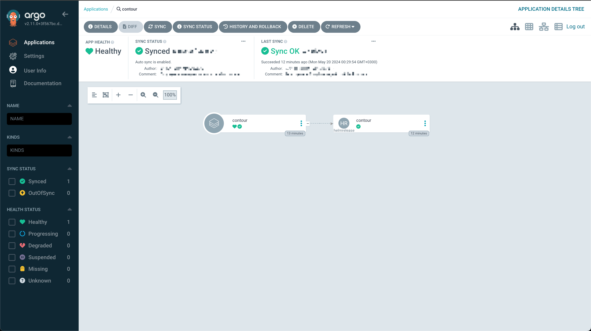
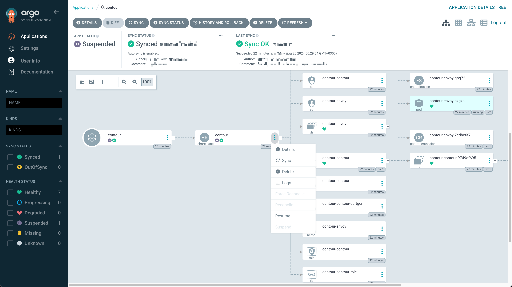

# Argo with Flux
This repository contains patches to monitor and manage Flux controlled resources from Argo app.

# Example
## Without patches
* No resource tracking
* No custom actions (Reconcile/Suspend)

## Patched version
* Actual statuses of resources from helm-controller/kustomizaion-controller managed by Flux
  (find the image below)
* All common actions available in Flux CLI can be performed via Argo UI (at the image below 
HelmRelease is suspended using the appropriate action button)
* All resources created by HelmRelease presented and tracked in Argo UI

# Important notice
**HelmRelease must be v2 (without `beta\*` suffix)**, custom resources were introduced in Flux 2.3.0, **you
need to use Flux version 2.3.0 or above**.

# Why not just use WeaveWorks GitOps?
If you use Flux **without** Argo, it has its own third-party UI named WeaveWorks GitOps, but the developer
company was [closed](https://www.crn.com/news/cloud/2024/aws-backed-kubernetes-company-weaveworks-closes-ceo-blames-failed-m-a)
at the beginning of 2024.

Using Flux **and** Argo separately brings two different UI tools in your infrastructure with few benefits without
an integration between them.

Basically, **all main functions of WeaveWorks GitOps have already been ported into Argo with the patches
in this project**
(e.g. custom resources status, custom actions, a tree of the controlled resources from an app).

# Why not just use Argo without Flux?
Argo applies custom logic to helm charts. Particularly, Argo renders Helm charts' templates before 
deployments, which can break complicated charts e.g. lifecycle hooks, lookup
functionality and some other cases.

The main purpose of using Argo with Flux together is to separate responsibilities, Argo deploys
static manifests, while Flux deploys Helm charts.

# Why vanilla Argo cannot work with Flux resources?
By default, Argo displays nested resources (resources implicitly created by a manifest from an app) using
**ownerReference metadata** from a cluster as a main path and applying transformation logic for corner 
cases and custom resources.

Unfortunately, **Flux does not use this logic**. A Flux resource's child 
(e.g. HelmRelease) can be namespace-scoped or cluster-wide, but ownerReference cannot
refer between namespaces or between cluster-scoped and namespace-scoped resources. Instead of
ownerReference Flux uses `helm.toolkit.fluxcd.io/name`/`kustomize.toolkit.fluxcd.io/name`
labels to track parent resource (Kustomization/HelmRelease).

### To solve this issue follow steps:
1. Patch `gitops-engine` (core of Argo) to implement an owner referencing resources with Flux labels
1. Recompile Argo with the patched version of `gitops-engine`

# Additional benefits of the patched version
* Health statuses for Flux resources
* Extra actions from Argo UI for Flux resources: Reconcile/Force Reconcile/Suspend/Resume

# Versioning
Example version tag: `v2.11.0-awf.g01.a01-main-bac623a5`
This tag represents a specific version with the following components:

- `v2.11.0`: Base version of ArgoCD
- `awf`: Static suffix indicates that the build supports "Argo with Flux" logic
- `g01`: Patch level for `gitops-engine`
- `a01`: Patch level for Argo
- `main`: Git branch where the changes are made
- `bac623a5`: Commit identifier for the specific changes made in this version
